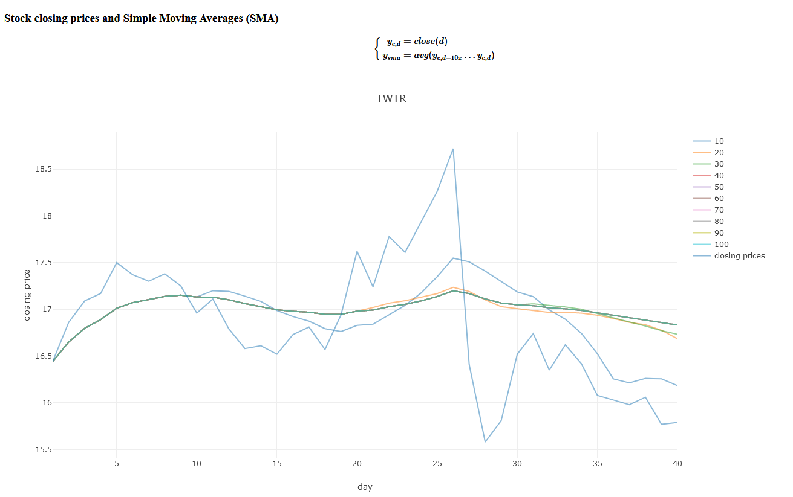

   
# Stockerface
Getting around with stock data.

Live preview: 
* http://95.216.220.118:8080/ - index page
* http://95.216.220.118:8080/bb?ticker=twtr&fromdate=20170102&todate=20170301 - bollinger bands
* http://95.216.220.118:8080/sma?ticker=twtr&fromdate=20170102&todate=20170301 - simple moving averages (you can change dates and tickers in URL from around 20140101 to around 20170330)  

# Project Overview
The general idea is to analyze stock data. One day in some future we hope to make this into a trading robot. For now, to get code done, its mostly important to have fun and build something interesting.  

The project reads closing-prices and info from the project [pystock-data](https://github.com/eliangcs/pystock-data), which is inserted into a database (sqlite). From there, we do simple analysis and present it using a websocket implementation combined with the all-powerful [plotly](https://plot.ly/) and [tablesaw](https://jtablesaw.github.io/tablesaw/). 

* `analytics` folder contains code for ML, analysis, etc.
* `dataprovider` folder contains code for getting stock-data and making it available for other projects
* `web` folder contains code for presenting views and running web server

# Setup
`git clone --recursive https://github.com/kwrl/qwde`  
if you forgot recursive:  
`git submodule update --init`

## Unix-like
We use `gradle` to build a java-application. Beware that e.g. Ubuntu's repo has an old version of gradle in their repos. To get a more recent version, please install with instructions [from the gradle main site](https://gradle.org/install/).  
We try to stay up to date on java, java 11+ should be supported. `sudo apt install openjdk` or similar should do the trick.

## Windows
Search-engine -> java gradle install :smile:

# Debug software
We ship with a java dependency that takes care of all database and network. If you want to look at/debug the database, install sqlite version 3 or higher. After that, you can run something like `sqlite3 $XDG_CACHE_HOME/qwde/database.db`.

# Executables
`./gradlew :web:run`  
or  
`./gradlew build` to produce a runnable webserver at `./web/build/libs/shadow-<VERSION>-all.jar`. You can run this with `java -jar`. To make sure you find the data, make sure to either run (and copy) the jar file to the project root, or point `$XDG_DATA_HOME` to the folder containing pystock-data.  Our [configuration directory](./web/configuration) contains the setup we use at Hetzner-server.

By default a sqlite database copy of pystock-data is written to   
* Unix: `$XDG_CACHE_HOME` (default ~/.cache/qwde)  
* Windows: `%APPDATA%/qwde/cache`  

Upon running the application, it is checked whether or not the database exists and has data. If not, it is generated. To re-generate the data, you can point `$XDG_CACHE_HOME` elsewhere, or delete the database.db file.

## Live server
Code is continuously deployed to http://95.216.220.118. Its a droplet with 2CPU and 8 GB RAM. If you want access, send me an email or PM.

# Contributing
Pull- and feature-requests welcome! :smile:

The main requirements for any PR is that the tests still run. In general there will be no thorough code review unless you explicitly ask for it. This is to make it easier to "just fix things" and avoid the corporate procedures we normally go through 9 to 5. At least until the project is of a certain size.

Also, to speed up development, the policy is that all code can be moved around, refactored or deleted. As long as the tests run. Though, I wouldn't touch other people's code too much unless I saw a _good_ reason to do so.

If you contribute with (scientific) code, a small explanation is much obliged. We also put some small footnotes on [the wiki](https://github.com/kwrl/qwde/wiki).
